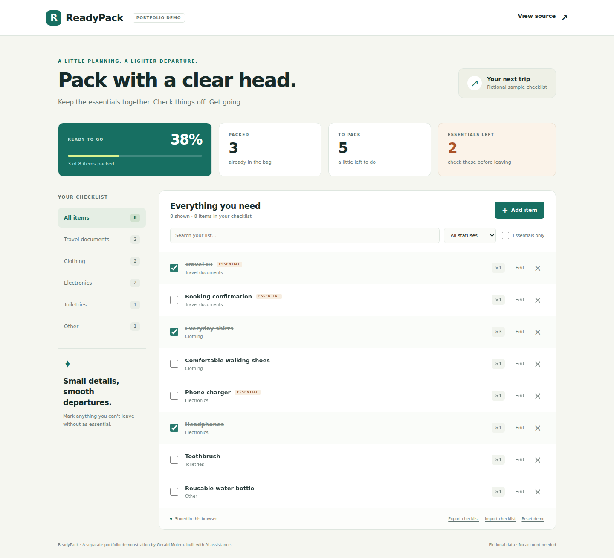

# ReadyPack — packing checklist demo

**Also in this portfolio:** [Bilingual Intake Lab](chatbot/README.md) — a standalone bilingual guided-intake demo with structured-response validation and QA evidence. [Try it live](https://gerald219.github.io/NEW_PROJECT_2026/chatbot/).

A small, independent portfolio demonstration of a packing checklist. It follows the packing-project idea originally recorded in this repository; that note is preserved in [docs/original-project-note.md](docs/original-project-note.md).

ReadyPack was developed with AI assistance. It is separate from private business work and uses fictional sample items.



## Live demo

[Open ReadyPack](https://gerald219.github.io/NEW_PROJECT_2026/) — no account needed.

## Try it locally

Requirements: Node.js 22 or newer; Node 24 is used for validation and CI.

```bash
git clone https://github.com/Gerald219/NEW_PROJECT_2026.git
cd NEW_PROJECT_2026
npm start
```

Open `http://127.0.0.1:8000`. The application itself uses plain HTML, CSS, and JavaScript with no third-party runtime dependencies.

## What works

- Add, edit, pack/unpack, and delete items; undo the last deletion.
- Set categories, quantities, and essential flags.
- Combine category, search, packing status, and essential filters.
- View progress and outstanding essentials.
- Save changes in the same browser with local storage.
- Export/import a validated JSON checklist and reset fictional sample data.
- Use desktop and narrow-screen layouts, labeled controls, and a keyboard-accessible item dialog.

## Test

Core tests need no package installation:

```bash
npm test
```

For process-level browser checks and screenshots:

```bash
npm ci
npx playwright install chromium
npm run test:browser
```

The browser script starts and stops its own local server. `TEST_PORT` selects its port; `CHROME_EXECUTABLE_PATH` can select an existing Chromium executable. These overrides are optional.

GitHub Actions runs the core tests and browser checks. [Validation results](docs/qa/results.md) identify what was tested and what remains unverified.

## Portfolio and QA material

- [One-minute walkthrough](docs/walkthrough.md)
- [QA test plan](docs/qa/test-plan.md)
- [Three real bug report samples from public coursework](docs/qa/bug-reports.md)
- [Desktop screenshot](docs/screenshots/desktop.png)
- [Mobile screenshot](docs/screenshots/mobile.png)
- [Item form screenshot](docs/screenshots/item-form.png)
- [Published profile introduction](https://github.com/Gerald219)

## Implementation

| File | Purpose |
| --- | --- |
| `index.html`, `styles.css` | Semantic page structure and responsive styling |
| `js/checklist.js` | Validation, filtering, summaries, and import/export |
| `js/app.js` | DOM rendering, input handling, and browser persistence |
| `tests/checklist.test.js` | Core behavior and invalid-input regression tests |
| `tests/browser-checks.cjs` | Actual browser workflow checks and screenshots |
| `scripts/serve.mjs` | Local static development server |

User-entered names are rendered with `textContent`. Imports require the expected schema, unique identifiers, valid quantities and flags, and at most 500 rows. The app reports storage failures instead of silently claiming persistence.

## Hosting and limitations

GitHub Pages serves this demo from **main → / (root)**. The [live demo](https://gerald219.github.io/NEW_PROJECT_2026/) and [profile introduction](https://github.com/Gerald219) are published.

This is a browser-only demonstration, not a production client service. It has no backend, sign-in, cloud database, or multi-device synchronization. Browser storage can be cleared and is not a secure store for personal documents or client records. Cross-browser, assistive-technology, and physical-device testing are still follow-up work.

[Gerald Mulero (@Gerald219)](https://github.com/Gerald219)
