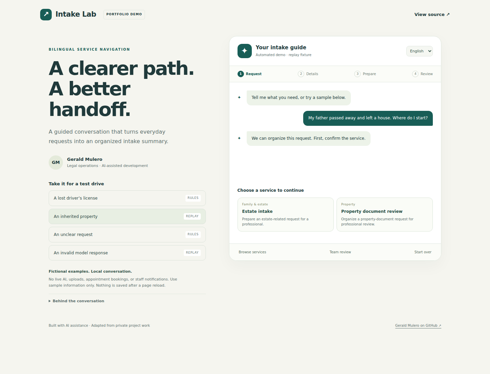

# Bilingual Intake Lab

**[Try the live demo](https://gerald219.github.io/NEW_PROJECT_2026/chatbot/)** · [Source](js/) · [Validation](docs/validation.md)

A standalone English/Spanish service-navigation demonstration adapted from Gerald Mulero's AI-assisted legal-intake project work. It shows service recognition, conversational workflow design, structured-response validation, and simulated escalation in a form employers can run without an account.



## Try it in one minute

1. Choose **An inherited property** to replay a structured response with two service cards. The replay is a fixed fixture, not a live model answer.
2. Choose a card and a topic, mark sample document readiness, and select urgency and follow-up preference.
3. Review or export the fictional summary. No request is sent and no appointment is booked.
4. Switch to **Español** and try a lost-license request.
5. Try **An invalid model response** or three unclear requests to inspect recovery and simulated handoff.

## What runs

- Bilingual phrase recognition with accent normalization, word boundaries, and ranked catalog matches.
- Service cards and an affidavit-type selector.
- Guided stages: request → confirmation → detail → document readiness → urgency → preference → summary.
- Focused clarification, catalog recovery, and simulated team review after repeated failures.
- Mandatory simulated handoff for criminal requests or explicit requests for a person.
- Schema/type validation and exact catalog-name resolution for replayed model responses.
- A fictional contact summary and downloadable JSON; conversation stays in memory and resets on reload.
- Desktop/mobile layouts and keyboard focus handling.

## What is simulated

There is **no live LLM, Base44 connection, client database, document upload, real appointment inventory, or staff notification**. The **rules** path is deterministic. **Replay** buttons supply fixed structured examples through an injectable adapter. The adapter contract and prompts demonstrate the AI-integration boundary; adding a live provider requires a server-side integration and further testing. Never put provider credentials in a browser bundle.

The public catalog contains fictional examples for routing only. It does not establish legal requirements or give legal advice.

## Contributions and provenance

This adaptation is based on four source files Gerald supplied from his AI-assisted legal-intake project: `AdaptiveIntake.jsx`, `assistantPrompt.js`, `situationReasoning.js`, and `serviceRecognition.js`. The supplied code implements bilingual prompts, service scoring, structured LLM calls, and a staged intake workflow.

The original React UI depends on additional private components and backend functions that were not supplied. This public version is an **AI-assisted JavaScript adaptation**, with a new interface and fictional catalog. It preserves the original architectural ideas while replacing private dependencies and making demonstration boundaries explicit. It is not an exact visual copy of the private application.

Private office details, original raw prompts, client records, and backend integrations are excluded. Added validation and tests apply to this public adaptation; they do not certify the private application.

See [source mapping](docs/source-mapping.md), [architecture](docs/architecture.md), and [regression examples](docs/regressions.md).

## Run and test locally

Requirements: Node.js 22 or newer. From the repository root:

```bash
npm start
```

Open `http://127.0.0.1:8000/chatbot/`. The browser application uses standard HTML, CSS, and JavaScript without runtime packages.

```bash
# All core tests: packing demo plus intake demo
npm test
# Intake tests only
node --test tests/chatbot.test.js
# Actual browser workflows
npm ci
npx playwright install chromium
npm run test:chatbot:browser
```

`CHROME_EXECUTABLE_PATH` selects an existing Chromium executable. GitHub Actions runs both demos' tests. [Validation results](docs/validation.md) distinguish checked behavior from remaining work.

## Relevant skills

JavaScript modules, bilingual conversation design, prompt design, deterministic matching, JSON response validation, state machines, manual and automated QA, Playwright, technical documentation, and translating administrative procedures into application workflows.

## Limits

Matching uses a curated phrase list, not general semantic understanding or typo correction. Urgency detection is a prompt for user confirmation, not a legal or safety assessment. No production backend, identity verification, legal-citation retrieval, or real human chat is included. Firefox, Safari, screen readers, physical devices, and live model behavior remain unverified. Passing sample tests does not establish production readiness.

[Gerald Mulero on GitHub](https://github.com/Gerald219)
