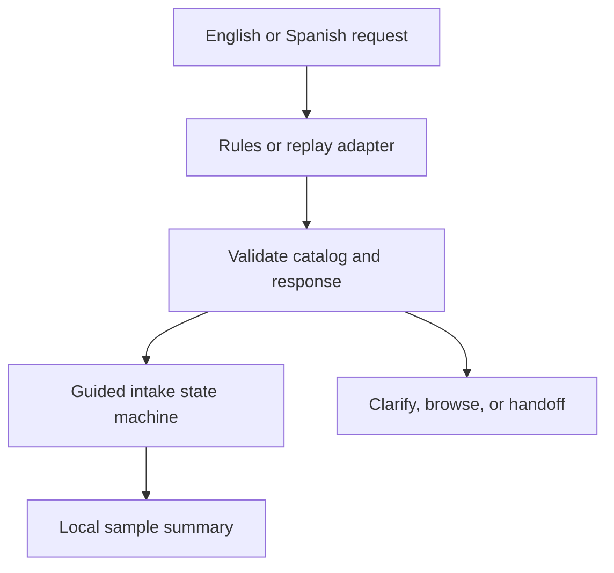

# Architecture

The UI sends request text to `AdaptiveIntake.submit`. Direct person/criminal matches take priority. Otherwise `reasonAboutSituation` either runs phrase recognition or invokes the supplied replay adapter. Structured results must pass `validateReasoning` before the UI can offer service cards.

The state machine controls transitions. Model output cannot book an appointment, submit data, or skip required stages. An unknown request first receives a clarifying question, then a catalog, then simulated handoff. Selecting a catalog service recovers the workflow.

The summary reuses the original request, selected detail, document readiness, urgency and preference. A revision counter prevents an old asynchronous response from restoring a reset session or replacing a human handoff. User text is rendered with `textContent`.

## Modules

| Module | Responsibility |
| --- | --- |
| `catalog.js` | Fictional bilingual service data |
| `serviceRecognition.js` | Normalization, phrase scoring, ranked matches |
| `assistantPrompt.js` | Sanitized conversation-policy example |
| `situationReasoning.js` | Prompt/schema contract, exact resolution, response validation, fixtures |
| `AdaptiveIntake.js` | Workflow state and transition checks |
| `app.js` | Browser rendering, actions, language selection, export |

## Integration boundary

`reasonAboutSituation(text, lang, adapter)` accepts an asynchronous adapter returning the documented JSON object. All exported schema fields are checked locally. The included fixtures demonstrate response acceptance and rejection, not model reasoning quality. A future live integration needs a protected backend, timeout/cancellation behavior, provider failure handling, factual evaluation, and privacy review.
